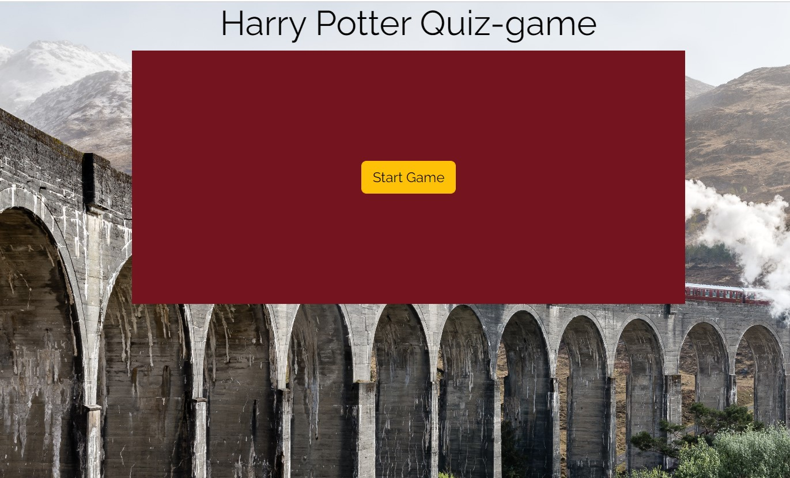
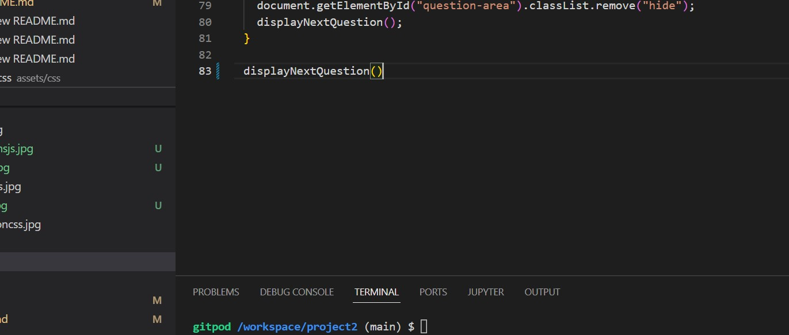
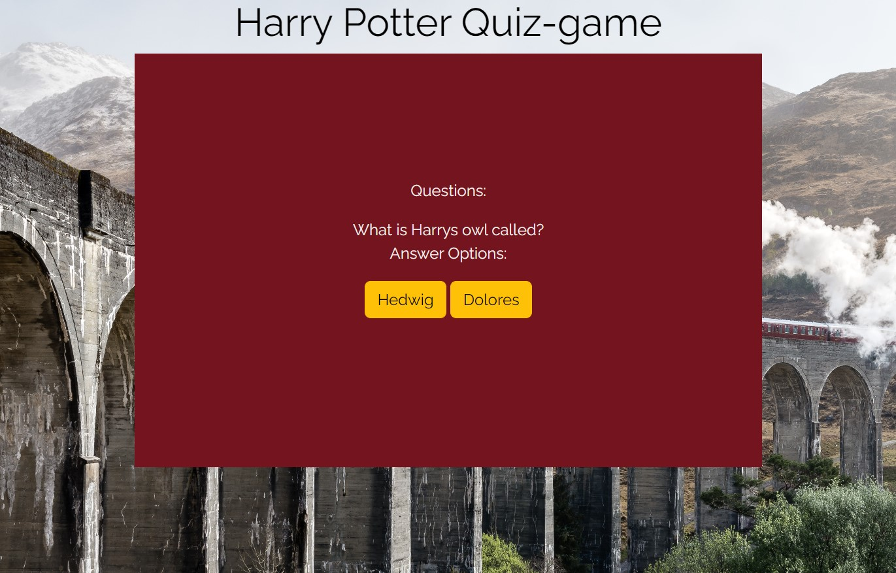
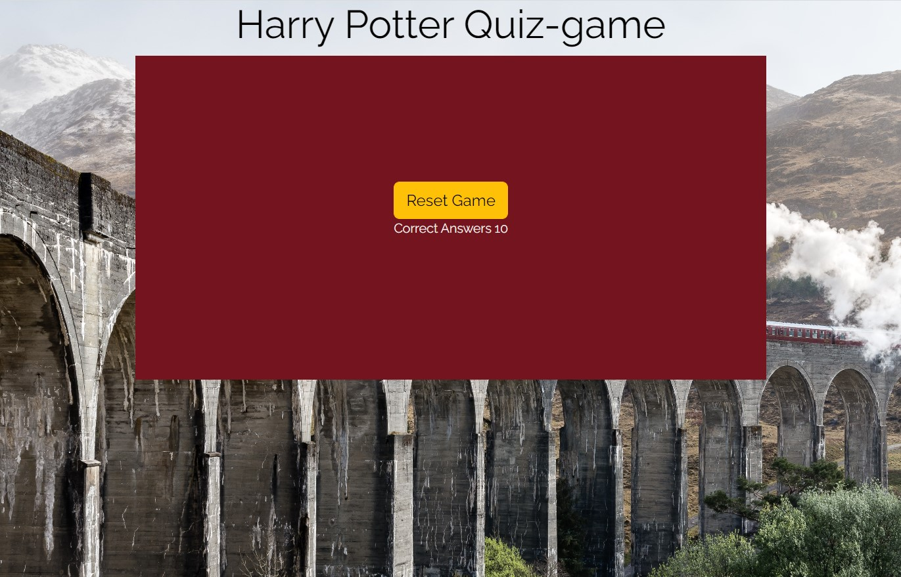
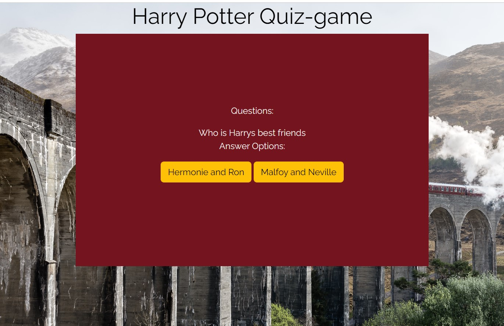
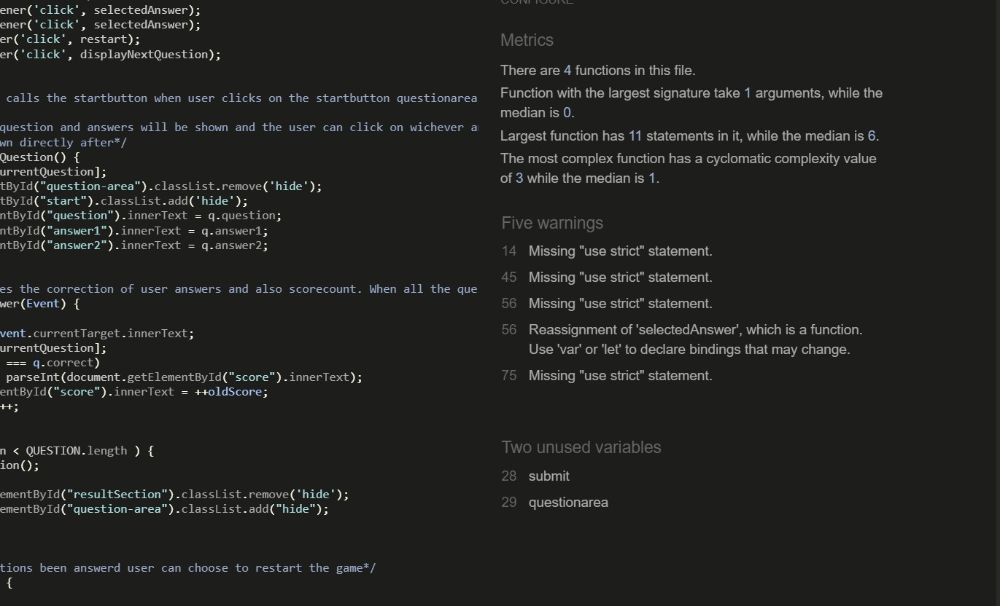

# Welcome to makarska

If you are a Harry Potter fan and know everything about Harry Potter and his magical World, you should absolutly try this quiz game based on the books of Harry potter. User will be provided with 15 questions about Harry Potter and his magical world. Se how many you can score correct answer on.

## User Stories

User will be provided with the game questions directly. User will answer a question with 2 answer options. The game redirects automaticly to the next question. When the user has answerd the last question player will be provided with their score and a option to restart the game.

 

### Features
* A game area containing question and answer options
 * Two buttons containing the answer options
* After finished game the scoreboard will appear with scores in correct answers 
 * A restart button will appear that rests the game

### Future Features

* Add a scoreboard with questions and right answers so user can se wich questions they got wrong
* Add levels with: "easy questions and hard questions" that user csn choose between
 

## Wireframe

My original wireframe was an easy and clean design. When I got it on screen I added some changes.
WHAT CHSAGES

PICTURE

## Technology

* Github to store my repostories
* Gitpod used to work with my HTML,CSS and javascript codes on
* W3C Validator to validat my HTML codes
* CSS Validator to validate my CSS codes
* JS validator JS HINTS
* HTML for codes to build the webpage
* CSS codes for styling
* Javascript for functions
 

## Testing and Bugs
#### Startpage

 

First page user will see is the startbutton. Tests preformed on the startbutton:
 * Pressing the button that will redirect user to the game.
Bugs detected during this step:
 * I problem detected in the beginning, the startbutton was not shown in the beginning as is should. I looked trough my javascript functions and traced every step from code to screen and saw that at the end the displayNextQuestion function was called as the first function to render. When I changed this to insted state startGame as first function, my code worked.

 

Questionarea is showed with a question and answer otpions, tests I preformed:
 
 * Pressing any button to get redirected. Buttons worked fine and I got redriected.

 
  
 
The page should show scorepoints and a "Reset button". Tests I preformed:
  
  * Trying to press Reset button after seeing scorepoint. Workes as it should.
Bugs detected
  * The Resetbutton was not showing. Viewd first the function and it looked proper. In the CSS file the bug was detected. There was a spelling error in the class of the section containing "Reset Game" button. Class of 'Hint' spelled Hint insted of .Hint. The dot was missing. When fixed it worked.
  

 
  
 
Resetbutton should render user back to question-area. Tests preformed:
  
  * Pressed the button and got redirected to question-area. Code workes as it is supposed/p>

### Unfixed bugs
No unfixed bugs

### Screen testing
Tested on screens:
  
  * Webbrowser
  * Iphone SE
  * Ipad Mini

### Validator

* Use strict argument was detected as an error in the validator. The code worked fine without the Use Strict argument and the app was not yet that big that I needed to write that secure Javascript.

* o errors at the CSS validator

* o errors detected on the HTML validator

## Deployment

* Deployment on github: I went to mo reposistoris and clicked on my project. Then went to settings--pages and than choose "main" in the scroll bar in the branch section. Then clicked save.

* On gitpod:First I choose "terminal" from the bar to the top left. There I chose "New terminal" to have one more terminal to work with. Then I wrote "python3 -m http.server" in the first terminal and enter.

## Credits
* Code Institution for educational material
* My mentor for guidance in the makinig of my project
* 

### Media
  
   The free photos where taken from pexels  
