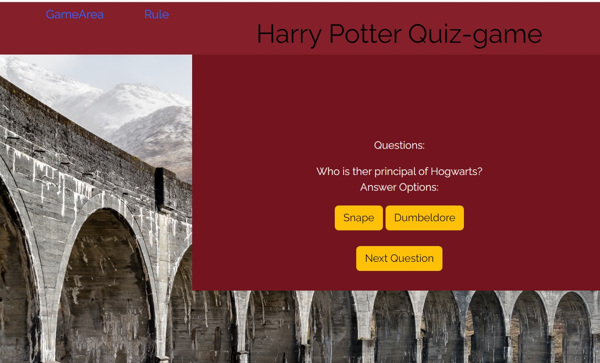
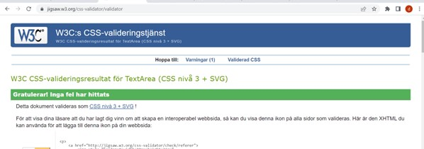
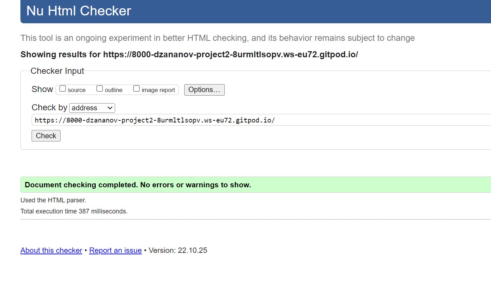

# Welcome to makarska

If you are a Harry Potter fan and know everything about Harry Potter and his magical World, you should absolutly try this quiz game based on the books of Harry potter. User will be provided with 15 questions about Harry Potter and his magical world. Se how many you can score correct answer on.

## User Stories

* User can navigate trough the navbar menu containing the Game and a section for Rules.
* User can press button start game to start the game and see the questions
* User can choose between answer options
* User can press on 'next' button to go on to the next question. User can only go on to next question if the first one is answerd
* User can see their scorepoints at the end of the game
* User can press restart game at the end of the game. User will then be redirected to the beginning.
 

### Features
* A start button that starts the game
* A game area containing question and answer options
 * Two buttons containing the answer options
 * Also a next button so user can choose when to go on
* After finished game the scoreboard will appear with scores in correct answers 
 * A restart button will appear that rests the game

### Future Features

* Add a scoreboard with questions and right answers so user can se wich questions they got wrong
* Add levels with: "easy questions and hard questions" that user csn choose between
 

## Technology

* Github to store my repostories
* Gitpod used to work with my HTML,CSS and javascript codes on
* W3C Validator to validat my HTML codes
* CSS Validator to validate my CSS codes
* JS validator JS HINTS
* HTML for codes to build the webpage
* CSS codes for styling
* Javascript for functions
 

## Testing and Bugs

### Testing

|Test | What to do | Status |
|----|:---------|:-------|
|Tested my navbar | I clicked on 'Game' and then I scrolled back up and clicked on 'Rules*  | good |
|Tested my startbutton| I clicked on the 'Game' link in the menu bar. Then I pressed the yellow 'Start' button that should start the game.| good |
|Try to press an option answer| When the game area is shown, question and answer will be showen. Tried pressing an answer option to se if the 'Next' button will show that is supposed to redirect user to next question when pressed| good |
|Pressing the 'Next' button without choosing an answer.| I first try pressing the 'next' button before I press on any answer option, to se if the button will work. It is not supposed to work before user chooses an answer, as mentioned in the rules| good |
|Pressing 'next' button after choosing an answer | I answer the question by pressing one of the two options and the I clicked on the 'next' button| good |
|Se score| Because I knew the answers I answerd some wrong and some right to se if my scorepoint is showing the right scores| good |
|Restart| After the game ended I try to press the 'restart' button to reset the game | good |

#### Testcase 1(Changes done after this image was taken: Added navbar.)

#### Testcase 1 and 3-5

#### Testcase 6-7

###  Bugs
 * I problem detected in the beginning, the startbutton was not shown in the beginning as is should. I looked trough my javascript functions and traced every step from code to screen and saw that at the end the displayNextQuestion function was called as the first function to render. When I changed this to insted state startGame as first function, my code worked.

### Unfixed bugs
No unfixed bugs

### Screen testing
The pages should be responsive and work on all screens. I Tested it on a couple of differente screens:
  
  * Webbrowser
  * Iphone SE
  * Ipad Mini

### Validator

* Use strict argument was detected as an error in the validator. The code worked fine without the Use Strict argument and the app was not yet that big that I needed to write that secure Javascript.

* o errors at the CSS validator

* o errors detected on the HTML validator

## Deployment

### Github
 Deployment on github: I went to mo reposistoris and clicked on my project. Then went to settings--pages and than choose "main" in the scroll bar in the branch section. Then clicked save.

### Gitpod
 On gitpod:First I choose "terminal" from the bar to the top left. There I chose "New terminal" to have one more terminal to work with. Then I wrote "python3 -m http.server" in the first terminal and enter.

## Credits
* Code Institution for educational material
* My mentor for guidance in the makinig of my project
* Loverunning project for footer code

### Media
  
   The free photos where taken from pexels  
